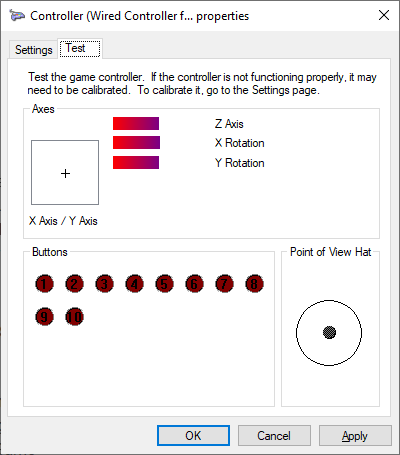

# HIDScout

## Rationale

In the process of developing hardware to implement a new USB HID usage page, I came to a realization: 
There's no current hardware that implements this usage page, so I have no way to test any software I might 
write. And there's no software that implements this usage page, so I have no way to test the hardware I'm
developing. 

In order to break out of that infinite loop, I decided to write a general-purpose utility that'll allow me
to look at the data reported by any HID class device, subject to operating system restrictions. 

## Features

Currently, *HIDScout* itself is not yet doing anything useful. It's a Win32 app with a XAML UI, taking advantage 
of the new [XAML Islands](https://docs.microsoft.com/en-us/windows/uwp/xaml-platform/xaml-host-controls) feature 
in the [Windows 10 October 2018 Update](https://support.microsoft.com/gl-es/help/4028685/windows-10-get-the-update), 
and I'm still learning my way around that particular frontier. However, all is not lost. If you need to see some 
HID data today, see *HIDReportTest* below.

## HIDReport

*HIDReport* is a Windows DLL that exposes information about the report structure of attached USB HID devices. 
It's still in its infancy, but it is currently capable of providing information about any USB HID device that 
can be opened. For now, that's just some identifying information, the heirarchical structure, and the usages 
of the controls on each device, but it'll likely be expanded in the future to include current states of all 
input controls as well as more static information (such as the size of values and whether they are relative or
absolute.)

It also contains a few unimplemented APIs that will provide human-readable descriptions of well-defined HID 
usages, plus an interface to the [Linux USB ID Repository](http://www.linux-usb.org/usb-ids.html).

## HIDReportTest

*HIDReportTest* is just what it says - an application to test the functionality of *HIDReport*. However, it's
also a completely functional application. When you run it from a command prompt, it will dump the entire HID
report tree for every attached device it can open.

Here's an example of the output. This device is a knockoff XBox360 controller made by "@Play," which is apparently
a Gamestop house brand. (But the USB vendor ID belongs to Logic3, whoever that is/was, and the manufacturer chose 
to not provide a name for themselves in the USB descriptor. Normally, that manufacturer name would precede the :: 
on the second line.)

~~~~
VID e6f  PID 501
    :: Controller (Wired Controller for Xbox 360)
      Input Max Report ID 0
         Report 0
            Usage 10005
            10 buttons 1 values 3 subcollections
            Button 90001
            Button 90002
            Button 90003
            Button 90004
            Button 90005
            Button 90006
            Button 90007
            Button 90008
            Button 90009
            Button 9000a
            Value  10039
            ----------------------------------
               Usage 10000
               1 values
               Value  10032
            ----------------------------------
               Usage 10000
               2 values
               Value  10034
               Value  10033
            ----------------------------------
               Usage 10000
               2 values
               Value  10031
               Value  10030
~~~~

This device uses well-known usage pages and usages, as you'd expect from a device that's a figment of the Windows 
XBox Controller driver's imagination. If you want to follow along at home, all of these values are defined in the
[USB HID Usage Tables](https://www.usb.org/sites/default/files/documents/hut1_12v2.pdf) document.

*HIDReport* reports all usages as a 32-bit number. The high word is the usage page, and the low word is the usage
within that page. Anything in the below description that maps a control in the HID report to a control on the controller
was discovered using the Controller Properties dialog in Windows 10:

This device has one Input report. That report's top-level usage is 00010005, which is on the Generic Desktop Page (0001)
and represents a Game Pad (0005). It contains 10 buttons, one non-button control, and three additional collections of
controls.

The ten buttons are on the Buttons page, and have the imaginative names "Button 1" through "Button 10." The value is
on the Generic Desktop page, again, and represents a hat switch. (This is the d-pad on the left side of the controller.)
This is consistent with the controller, which has ten buttons in various places. In order, those buttons are A, B, X, Y,
L, R, Back, Start, Left Stick, Right Stick.

The first subcollection has an undefined usage, and contains one control representing the Z axis. That value represents 
a combination of the two triggers. The formula appears to be something like 0 + left trigger - right trigger.

The second subcollection also has an undefined usage, and contains two controls representing the rX and rY axes. These 
are technically supposed to be rotational axes, but since there are two joysticks on the device, I guess they decided to
tag one as rotational whether or not that made sense. This is the right stick.

The third subcollection, shockingly, also has an undefined usage, and contains two controls representing the X and Y axes.
This is the left stick.

## Troubleshooting

If you have an attached device that you'd expect to see in the listing, you may find that you have to stop 
a service or some other software that's currently attached to that device in exclusive mode. For example, to
see my Wacom Intuos tablet, I have to stop the Wacom service. (Sadly, all of the usages it reports are 
vendor-specific, so there's no particular joy in doing so.)

